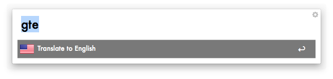
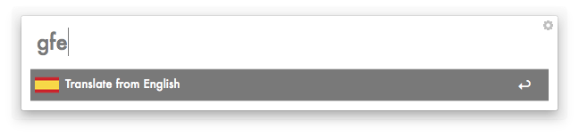
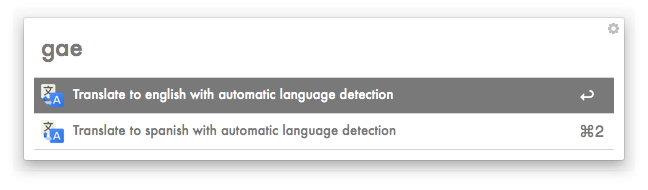

Google Translate to Spanish Alfred Workflow
=============================

A workflow for Alfred 2 that implements translation from spanish to english and vice versa.

It's based on PHP and not very complex to understand.

## How to install
Just download and double click the [workflow file].
Say "yes" to import it into Alfred. Done!

## How to use
Open Alfred and type "gten" to translate from spanish to english. Type "gtes" to translate from english to spanish.

You can also use "gaen" to translate to english and let google autodetect the incoming language. "gaes" does the same but translates to german.

Alfred will show all the results that Google returned. Select the one that fits your situation best and the translated phrase will be copied to the clipboard.

## Screenshots
This is how it should look like:

## What is missing?
Right now, the workflow only translates from german to english and vice versa. Technically this can be changed very easily. I just have to find a nice way to do it without making the request much longer.

Feel free to fork and/or make suggestions.

This is a Fork from Thomas original script all kudos go to him.
